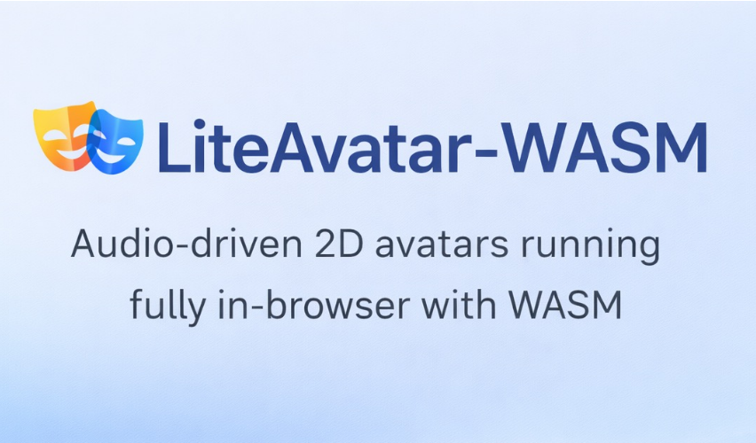

# LiteAvatar - Browser Version

<div align="center">
  
</div>

A browser-based implementation of LiteAvatar using WASM. No backend server required.

This project adapts [HumanAIGC/lite-avatar](https://github.com/HumanAIGC/lite-avatar) for browser deployment. The original project requires Python backend and GPU acceleration, while this version runs entirely in the browser.

⚠️ **Note**: Model performance may not be optimal as the models are not fine-tuned or retrained. This project serves as a reference implementation for browser deployment.

## Features

- Browser-based processing using ONNX Runtime Web (WASM)
- Complete Paraformer feature extraction pipeline in browser (fbank + LFR + CMVN)
- Large models (>100MB) hosted on Hugging Face to avoid Git LFS limitations
- Static hosting support: GitHub Pages, Vercel, Netlify, etc.
- No backend dependencies

## Models

Models are large (>100MB) and excluded from Git. Download them manually from the links below.

### Required Models

- `weights/paraformer_hidden.onnx` (603MB FP32) - Paraformer encoder for feature extraction
- `weights/model_1.onnx` - Audio2mouth model
- `data/preload/net_encode.onnx` - Encoder model
- `data/preload/net_decode.onnx` - Decoder model

### Model Download

Models can be downloaded from:

- **Hugging Face** (Recommended): [fushengji/lite-avatar-wasm](https://huggingface.co/fushengji/lite-avatar-wasm)
  - `paraformer_hidden.onnx` (633MB)
  - `model_1.onnx` (184MB)

You can also download models from ModelScope or use the export scripts (see Development section below).

## Quick Start

### Local Preview

```bash
# Start a simple HTTP server
python -m http.server 8000

# Open http://localhost:8000 in your browser
```

### Deploy to GitHub Pages

1. **Push code to GitHub**:
   ```bash
   git add .
   git commit -m "Deploy to GitHub Pages"
   git push origin main
   ```

2. **Enable GitHub Pages**:
   - Go to: https://github.com/fusheng-ji/lite-avatar-WASM/settings/pages
   - In the "Source" section, select: **GitHub Actions**
   - Save settings

3. **Access your site**:
   - After deployment, visit: https://fusheng-ji.github.io/lite-avatar-WASM

### Deploy to Other Static Hosting

- **Vercel**: Connect your repository, it will auto-detect static files
- **Netlify**: Drag and drop your folder or connect via Git
- **Cloudflare Pages**: Connect repository and set build command to `echo "No build needed"`

## Usage

1. Place model files in the correct paths (or update paths in `js/config.js`)
2. Open `index.html` in your browser
3. Upload audio file (or use default sample audio / microphone recording)
4. Upload avatar data (or use default sample data)
5. Click "Generate Video" and wait for rendering

## Data

- Sample data: `data/preload/` contains sample avatar data (`bg_video.mp4`, `neutral_pose.npy`, `face_box.txt`, `ref_frames/`, etc.)
- More avatars: [LiteAvatarGallery](https://modelscope.cn/models/HumanAIGC-Engineering/LiteAvatarGallery/summary)

## Project Layout

```
lite-avatar-WASM/
├── index.html                  # Main HTML file
├── assets/
│   └── banner.svg             # Project banner
├── js/
│   ├── lite-avatar-web.js     # Main frontend logic
│   ├── paraformer-frontend.js # Paraformer feature extraction (fbank + LFR + CMVN)
│   ├── config.js              # Configuration
│   └── i18n.js                # Internationalization
├── weights/
│   ├── paraformer_hidden.onnx # Paraformer encoder (603MB, download from Hugging Face)
│   └── model_1.onnx            # Audio2mouth model (download from Hugging Face)
├── data/
│   └── preload/               # Sample avatar data
│       ├── net_encode.onnx   # Encoder model
│       ├── net_decode.onnx   # Decoder model
│       ├── bg_video.mp4      # Background video
│       ├── neutral_pose.npy  # Neutral pose data
│       ├── face_box.txt      # Face bounding box
│       └── ref_frames/       # Reference frames (150 jpg files)
├── utils/
│   ├── export_paraformer_hidden_onnx.py  # Export Paraformer to ONNX
│   └── test_paraformer_onnx.py           # Test exported ONNX model
├── extract_paraformer_feature.py        # Paraformer feature extraction utility
├── funasr_local/              # FunASR local dependencies (for model export)
├── requirements.txt           # Python dependencies
└── README.md                  # This file
```

## Development

### Export Paraformer Model to ONNX

The `utils/` directory contains scripts for exporting the Paraformer model from PyTorch to ONNX format.

#### Prerequisites

```bash
# Install dependencies
pip install torch onnxruntime funasr
```

#### Export Process

1. **Prepare Model Files**

   Ensure you have the Paraformer model files in the correct location:
   ```
   weights/speech_paraformer-large_asr_nat-zh-cn-16k-common-vocab8404-pytorch/
   ├── config.yaml
   ├── model.pb
   └── am.mvn
   ```

2. **Export to ONNX**

   Run the export script:
   ```bash
   cd utils
   python export_paraformer_hidden_onnx.py
   ```

   The script loads the Paraformer model from PyTorch format, wraps it with `ParaformerHiddenWrapperSingleInput` (from `extract_paraformer_feature.py`), exports the encoder hidden states to ONNX format, and saves it as `weights/paraformer_hidden.onnx`.

3. **Export Details**

   - **Input**: Frontend features (after LFR) with shape `[batch, time, 560]`
     - Feature dimension: 80 mels × 7 (LFR) = 560
     - Fixed time dimension: 150 frames (inputs longer than this will be truncated)
   - **Output**: Encoder hidden states
   - **Format**: FP32 ONNX model (opset version 17)
   - **Size**: ~603MB

4. **Test the Exported Model**

   Verify the exported ONNX model:
   ```bash
   cd utils
   python test_paraformer_onnx.py
   ```

   This script loads the ONNX model, displays input/output shapes, runs inference with dummy data, and verifies the model works correctly.

#### Important Notes

- The exported model uses a **fixed time dimension of 150 frames**
- Input sequences longer than 150 frames will cause runtime errors
- The frontend should truncate or pad inputs to exactly 150 frames
- The wrapper bypasses the frontend FFT to avoid `aten::fft_rfft` operations during export
- If the model is larger than 2GB, weights will be stored in a separate `.onnx_data` file

## Browser Compatibility

- **WASM**: All modern browsers (Chrome, Firefox, Safari, Edge)
- **Audio APIs**: Modern browsers with Web Audio API support

## Performance

- **Feature Extraction**: ~1-2 seconds for 5 seconds of audio (depends on device)
- **Video Generation**: ~5-10 seconds for 150 frames (depends on device)
- **Memory Usage**: ~1-2GB RAM (mainly for model loading)

## Credits

Based on [HumanAIGC/lite-avatar](https://github.com/HumanAIGC/lite-avatar), adapted for the browser.

Thanks to these projects:

- [LiteAvatar](https://github.com/HumanAIGC/lite-avatar) - Original real-time 2D chat avatar project
- [Paraformer](https://modelscope.cn/models/iic/speech_paraformer-large_asr_nat-zh-cn-16k-common-vocab8404-pytorch) & [FunASR](https://github.com/modelscope/FunASR) - Audio feature extraction
- [HeadTTS](https://github.com/met4citizen/HeadTTS) - Reference implementation
- [ONNX Runtime Web](https://onnxruntime.ai/docs/tutorials/web/) - Browser inference engine

## License

MIT License
